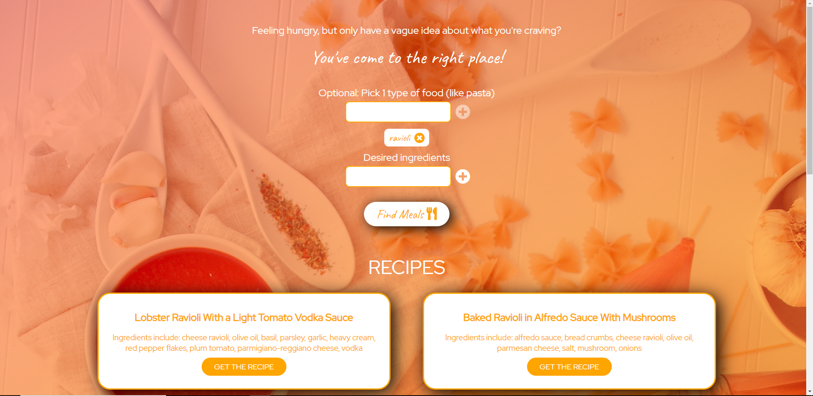

# Meal Picker App

A fun web app that gives you recipes for meals tailored around your desired ingredients and desired type of food, such as pasta, soup, etc. Built with fetch API and React.

To use, navigate in your command line to the folder and run "npm run build-dev".

